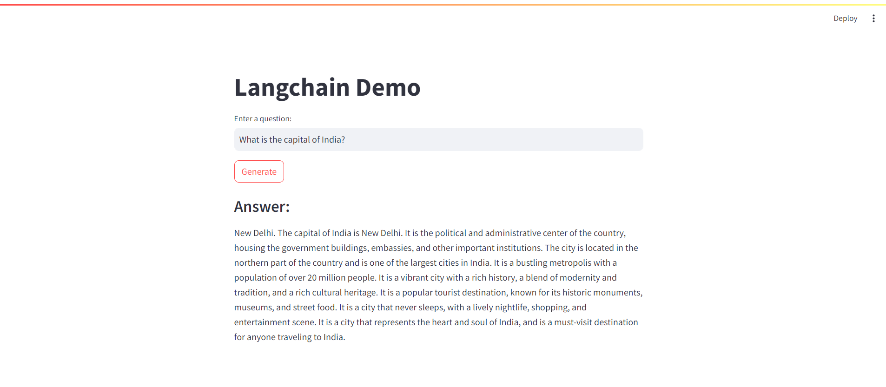

# Simple Question and Answer App

This application is a simple Q&A interface where users can ask questions and get answers generated by an AI model. It leverages the power of modern language models to provide informative and relevant responses.

## Features

- **Interactive Q&A**: Users can input questions and receive answers from the AI.
- **Real-Time Responses**: Answers are generated in real-time using advanced language models.

## Technologies Used

- **LangChain**: For integrating and managing language model interactions.
- **Hugging Face**: For accessing pre-trained language models.
- **Streamlit**: For building the web application interface.
- **Python**: For the application logic.

## Usage

- **Interact with the App**

    - Open your browser and navigate to `http://localhost:8501`.
    - Enter your question in the provided text area.
    - Click "Generate" to get an answer from the AI model.

## Attachment

