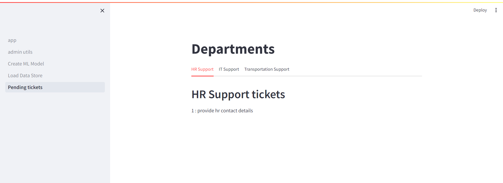

# Automatic Ticket Classification Tool

## Overview

This project is a web application built using Streamlit that classifies user-submitted tickets into different departments (HR, IT, and Transport) based on the content of the ticket. The application uses embeddings and machine learning models to analyze the input and determine the appropriate department for each ticket.

## Features

- **Ticket Classification**: Classifies tickets into HR, IT, or Transport departments based on their content.
- **Session State Management**: Stores classified tickets in session state for later use.

## Technologies Used

- **Streamlit**: For building the interactive web application.
- **Pinecone**: For storing and retrieving vector embeddings.
- **LangChain**: To create and manage agents for processing data and queries.
- **Hugging Face**: Provides the language model endpoint for natural language processing.
- **dotenv**: For managing environment variables.
- **Python**: General programming and scripting.

## Setup

### Prerequisites

- **Python**: 3.7 or later
- **Streamlit**
- **Pinecone**
- **LangChain**
- **Hugging Face library**
- **dotenv**

## Usage

1. Open the app in your browser at the address provided by Streamlit.
2. Enter the ticket content into the input field.
3. Click "Classify Ticket" to classify the ticket into one of the departments: HR, IT, or Transport.
4. View the classified ticket and its department on the interface.

## Attachments

