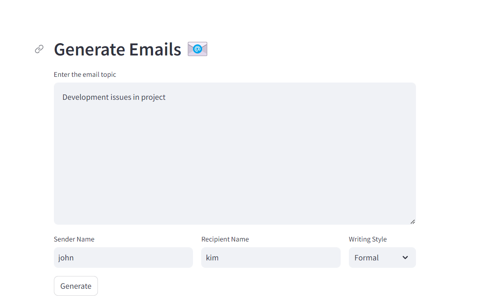

# Generate Emails Application

## Overview

The **Generate Emails Application** is a web-based tool built with Streamlit that helps users generate personalized email content based on a given topic, sender name, recipient name, and writing style. This application leverages the Llama-2-7B-Chat model via the CTransformers library to produce coherent and contextually relevant email content.

## Features

- **Input Details**: Allows users to input the email topic, sender name, recipient name, and select a writing style.
- **Email Generation**: Uses the Llama-2-7B-Chat model to generate email content based on the provided details.
- **Display Results**: Shows the generated email content directly in the application.

## Technologies Used

- **Streamlit**: Framework for building the interactive web application.
- **LangChain**: Used to create and manage the prompt template for generating emails.
- **CTransformers**: Utilizes the Llama-2-7B-Chat model for generating email content.
- **Hugging Face library**: For model integration and interaction.
- **dotenv**: For managing environment variables.

## Setup

### Prerequisites

- Python 3.7 or later
- Streamlit
- LangChain
- CTransformers
- Hugging Face library
- dotenv

## Usage

### Navigate to the Application

1. Open your web browser and go to [http://localhost:8501](http://localhost:8501) (or the URL where Streamlit is running).

### Enter Email Details

1. **Email Topic**:
   - **Input**: Enter the subject or main topic of the email in the provided text area.
   
2. **Sender Name**:
   - **Input**: Enter the name of the person sending the email.

3. **Recipient Name**:
   - **Input**: Enter the name of the person receiving the email.

4. **Writing Style**:
   - **Select**: Choose the desired writing style from the dropdown menu (e.g., formal, informal, friendly, professional).

### Generate Email

1. **Click the "Generate" Button**:
   - **Action**: Click the button to generate the email content based on the provided details.
   - **Result**: The application will create and display the email content.

### View Results

1. **Generated Email Content**:
   - **Display**: The application will show the generated email content on the screen.

## Detailed Functionality

### Session Variables

- **`unique_id`**:
  - **Purpose**: Generates a unique identifier for each session.
  - **Function**: Ensures that each user's data and interactions are managed independently, particularly when querying and retrieving documents.

### Main Functionality

1. **Load Environment Variables**:
   - **Description**: Uses `load_dotenv()` to load environment variables from the `.env` file.
   - **Purpose**: Manages sensitive configuration settings such as API keys.

2. **Set Up Streamlit Page Configuration**:
   - **Description**: Configures the Streamlit page, including settings like the title and layout.
   - **Purpose**: Provides a consistent and user-friendly interface.

3. **Capture User Input**:
   - **Description**: Collects input for the email topic, sender name, recipient name, and writing style.
   - **Purpose**: Gathers the necessary details to generate the email content.

4. **Generate Unique Session ID**:
   - **Description**: Creates a unique ID for the current user session.
   - **Purpose**: Manages user-specific interactions and data effectively.

5. **Email Generation**:
   - **Description**: Uses the Llama-2-7B-Chat model via CTransformers to generate the email content.
   - **Purpose**: Produces coherent and contextually appropriate email drafts based on user input.

6. **Display Email Content**:
   - **Description**: Shows the generated email content on the Streamlit interface.
   - **Purpose**: Allows the user to review, copy, or edit the generated email.

## Attachment

