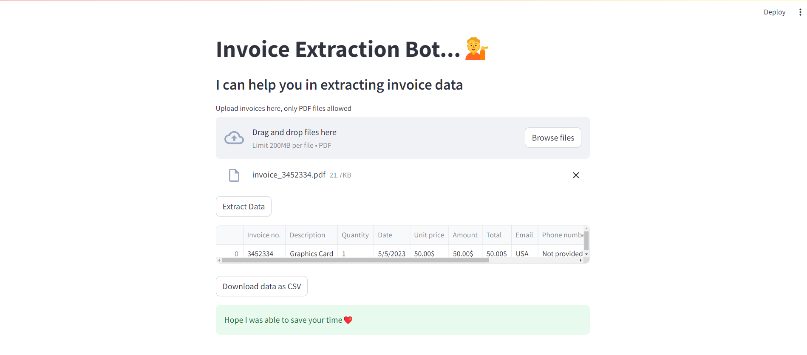

# Invoice Extraction Bot

## Overview
This project is a web application built using Streamlit that assists users in extracting data from invoices in PDF format. The application allows users to upload multiple invoice PDFs and provides extracted data in a tabular format. Users can then download the extracted data as a CSV file.

## Features
- **Upload multiple PDF invoices**: Allows uploading of several invoice PDFs for extraction.
- **Extract data from uploaded invoices**: Automatically extracts data from the uploaded invoices.
- **View the extracted data in a table**: Displays the extracted data in a tabular format.
- **Download the extracted data as a CSV file**: Enables downloading of the extracted data for further use.

## Technologies Used
- **Streamlit**: For building the interactive web application.
- **dotenv**: For managing environment variables.
- **Python**: General programming and scripting.

## Setup

### Prerequisites
- Python 3.7 or later
- Streamlit

## Usage

1. **Navigate to the Application**:
    - Open your web browser and go to [http://localhost:8501](http://localhost:8501) (or the URL where Streamlit is running).

2. **Upload Invoices**:
    - Upload the invoice PDFs using the file uploader.

3. **View Extracted Data**:
    - The application will display the extracted data in a table format.

4. **Download Data**:
    - Click the "Download as CSV" button to download the extracted data as a CSV file.

## Attachment

