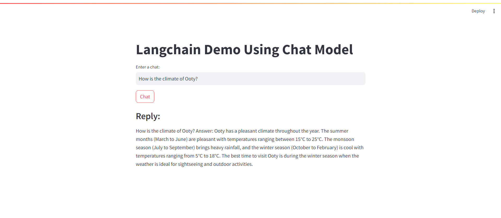

# Simple Conversational App

This application provides a basic conversational interface where users can engage in a dialogue with an AI model. It leverages modern language models to maintain a flow of conversation, making interactions more natural and engaging.

## Features

- **Conversational Interaction**: Users can engage in a back-and-forth conversation with the AI.
- **Contextual Responses**: The AI maintains the context of the conversation for more coherent interactions.

## Technologies Used

- **LangChain**: For managing conversational interactions with the AI model.
- **Hugging Face**: For accessing advanced language models.
- **Streamlit**: For building the user interface.
- **Python**: For the underlying application logic.

## Usage

- **Interact with the App**

    - Open your browser and navigate to `http://localhost:8501`.
    - Start a conversation by entering your message in the provided text area.
    - Click "Chat" to receive a response from the AI model.

## Attachement

