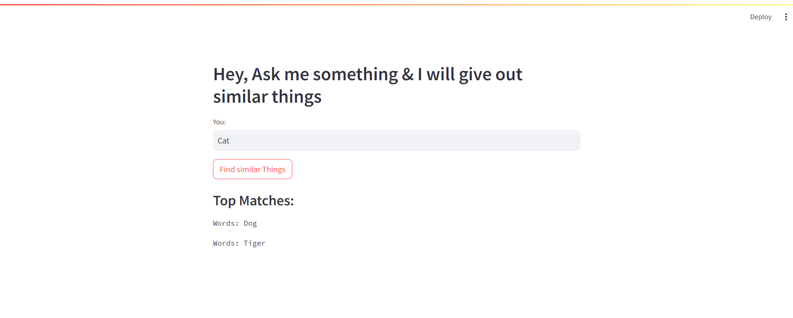

# Find Similar Things App for Kids

## Overview

This Streamlit-based web application helps find similar content from a CSV file using embeddings and FAISS for similarity search. Designed for educational activities, it assists kids by providing similar topics or concepts based on user queries.

## Features

- **Load Data**: Import data from a CSV file.
- **Semantic Search**: Use HuggingFace embeddings for finding similar content.
- **Similarity Search**: Perform similarity search with FAISS to find related topics.
- **Interactive Interface**: User-friendly interface for inputting queries and viewing results.

## Dependencies

- **streamlit**: Web app framework for interactive applications.
- **langchain**: Toolkit for building language model applications.
- **huggingface_hub**: Interface to HuggingFace models.
- **langchain_community**: Community tools and resources for LangChain.
- **python-dotenv**: Load environment variables from a `.env` file.

## Usage

- **Interact with the App**

    - Open your browser and navigate to `http://localhost:8501`.
    - Enter a query related to educational content in the text area.
    - Click "Find similar Things" to get suggestions based on the CSV data.

## Attachment

