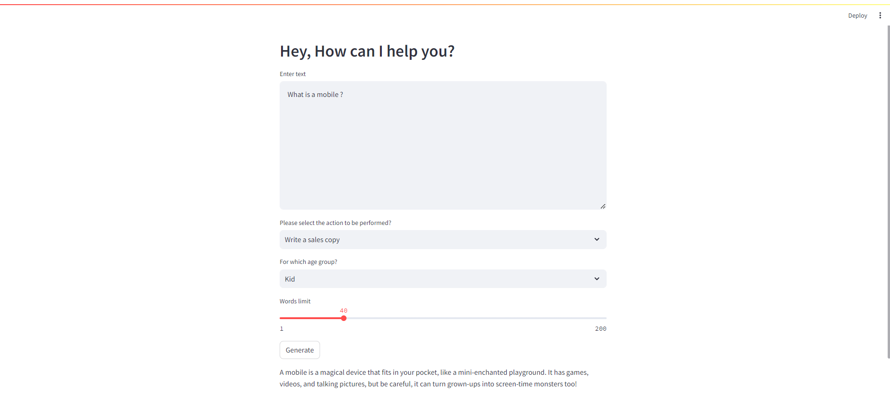

# Marketing Tool

## Overview

This is a Streamlit-based web application designed to generate marketing content using a language model from HuggingFace. The app can create various types of marketing content, including sales copy, tweets, and product descriptions, tailored to different age groups such as Kids, Adults, and Senior Citizens.

The application utilizes the HuggingFace model `huggingfaceh4/zephyr-7b-alpha` for content generation.

## Features

- **Generate Marketing Content**: Create customized marketing materials based on user input.
- **Content Type Selection**: Choose from Sales Copy, Tweet, or Product Description.
- **Target Age Group**: Select the target audience from Kids, Adults, or Senior Citizens.
- **Adjustable Word Limit**: Set the desired word limit for the generated content.

## Example Usage

1. **Enter Text**: For example, "What is a mobile?"
2. **Select Action**: Choose "Write a sales copy."
3. **Select Age Group**: Choose "Kid."
4. **Adjust Word Limit**: Set to 100 words.
5. **Click "Generate"**: Receive a fun and engaging sales copy suitable for kids.

## Dependencies

Ensure you have the following Python packages installed:

- `streamlit`: Framework for creating interactive web applications.
- `langchain`: Toolkit for building language model applications.
- `huggingface_hub`: Interface to HuggingFace models.
- `python-dotenv`: For loading environment variables from a `.env` file.

## Attachement

