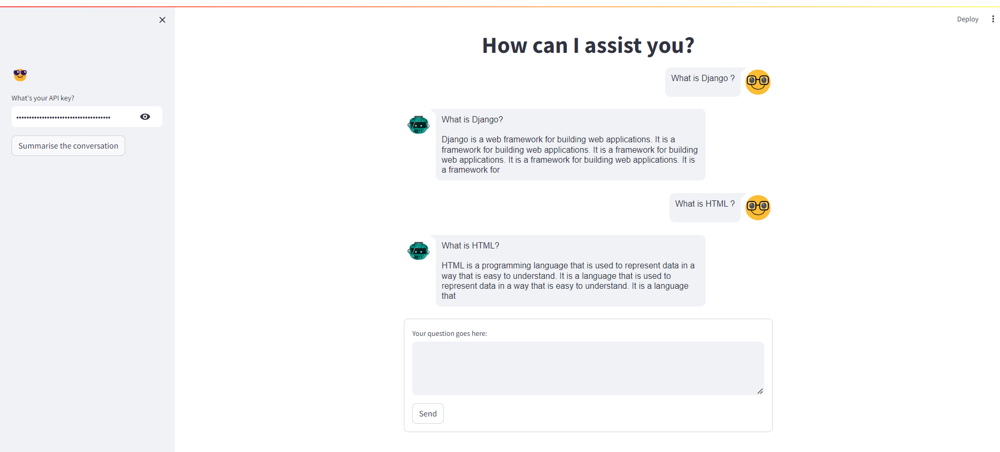
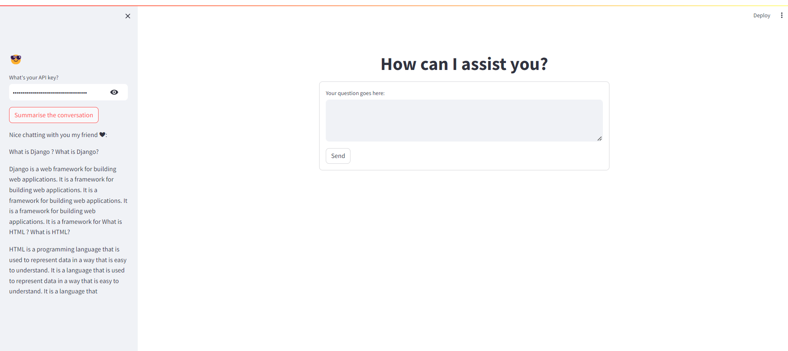

# Chat GPT Clone with Streamlit

This repository contains a simple chat application built using Streamlit and HuggingFace models for conversation and summarization.

## Features

- **Chat with a language model**
- **Summarize the conversation**

## Requirements

- Python 3.7 or higher
- Streamlit
- Langchain
- HuggingFace
- Langchain Community
- HuggingFace Hub
- Streamlit Chat

## Model Configuration

The app uses two Hugging Face models:

- **google/pegasus-cnn_dailymail** for summarization.
- **HuggingFaceH4/zephyr-7b-alpha** for conversation.

Ensure that you have access to these models from HuggingFace.

## Attachments

