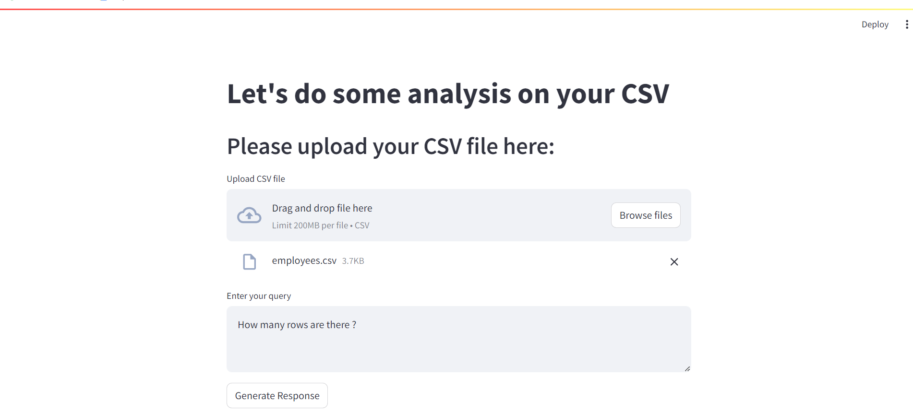

# CSV Analysis App

## Overview

This project is a web application built using Streamlit that allows users to upload a CSV file and perform various analyses based on their queries. The application leverages the LangChain framework and a Hugging Face language model to process the data and provide insights.

## Features

- **Upload a CSV file**: Easily upload your CSV files for analysis.
- **Enter a query**: Perform analysis on the uploaded data based on your specific queries.
- **Receive responses**: Get detailed responses and observations based on your query.

## Technologies Used

- **Streamlit**: For building the interactive web application.
- **LangChain**: To create and manage agents for processing data and queries.
- **Hugging Face**: Provides the language model endpoint for natural language processing.
- **Pandas**: For data manipulation and analysis.

## Setup

### Prerequisites

- Python 3.7 or later
- Streamlit
- LangChain
- Hugging Face library
- Pandas
- Python-dotenv (for environment variables)

## Usage

1. **Navigate to the Application**:

    Open your web browser and go to [http://localhost:8501](http://localhost:8501) (or the URL where Streamlit is running).

2. **Upload a CSV File**:

    Use the file uploader to select and upload your CSV file.

3. **Enter a Query**:

    Type your query in the text area provided. The query should be related to the data you uploaded.

4. **Generate Response**:

    Click the "Generate Response" button to receive the analysis results and observations.

## Attachment

