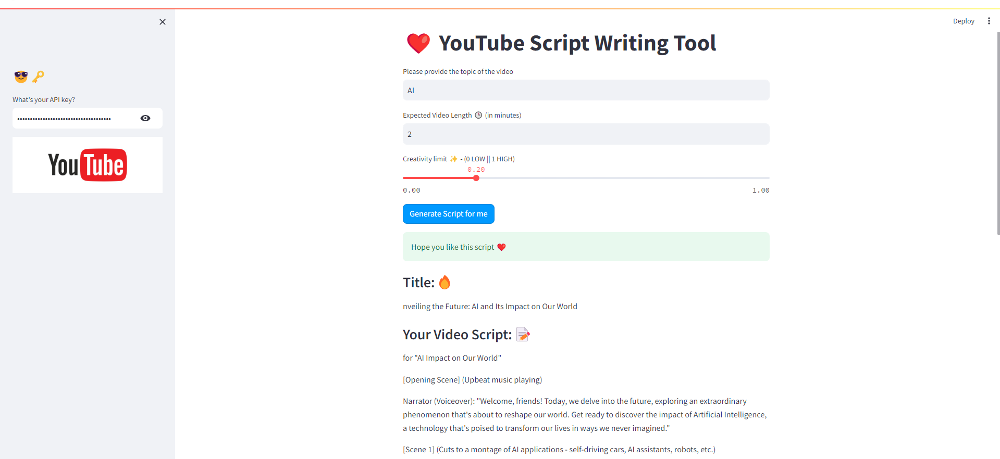
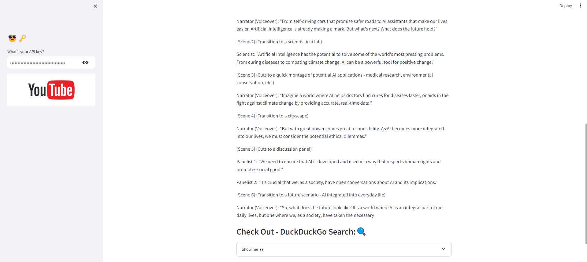

# YouTube Script Writing Tool

This Streamlit application helps you generate YouTube video scripts using the OpenAI API. It captures user inputs such as the video topic, expected video length, and creativity level, then generates a script based on these inputs.

## Features

- **Styled Buttons**: Custom styling for buttons to enhance the user interface.
- **Session State Management**: Securely manages the OpenAI API key using Streamlit's session state.
- **Sidebar Input**: Capture the OpenAI API key from the user in the sidebar.
- **User Inputs**: Collect video topic, expected video length, and creativity level from the user.
- **Script Generation**: Uses the OpenAI API to generate a YouTube video script.
- **Display Results**: Shows the generated title, script, and search engine results.

## Usage

1. Open the app in your browser at the address provided by Streamlit.
2. Enter your OpenAI API key in the sidebar.
3. Provide the following inputs:
    - **Video Topic**: The subject of your video.
    - **Expected Video Length**: The desired duration of the video.
    - **Creativity Level**: Adjust the creativity of the script.
4. Click on **"Generate Script for me"** to get your video script.
5. View the generated title, script, and search engine results on the app interface.

## Attachments

