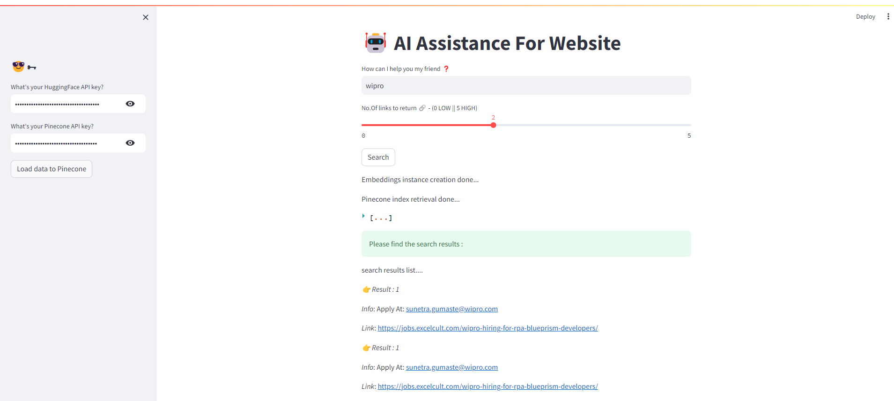

# AI Assistance For Website

This Streamlit application provides AI-powered assistance for website data retrieval and search functionality using HuggingFace and Pinecone APIs. The app captures user inputs for search queries and returns relevant documents based on those queries.

## Features

- **Session State Management**: Securely manages HuggingFace and Pinecone API keys using Streamlit's session state.
- **Sidebar Input**: Allows users to input HuggingFace and Pinecone API keys.
- **Data Loading**: Fetches data from a website and indexes it in Pinecone.
- **Search Functionality**: Retrieves and displays relevant documents from Pinecone based on user queries.

## How It Works

### Session State Initialization

- The application initializes session state variables for securely managing HuggingFace and Pinecone API keys.

### Sidebar Functionality

- **API Key Input**: Users input their HuggingFace and Pinecone API keys in the sidebar.
- **Data Loading**: Clicking the "Load data to Pinecone" button fetches data from a website, splits it into chunks, creates embeddings, and pushes the data to Pinecone.

### Main Interface

- **Search Query Input**: Users enter their search query and specify the number of relevant links to return.
- **Search Execution**: Clicking the "Search" button creates embeddings for the query, retrieves the Pinecone index, fetches relevant documents, and displays the search results.

## Key Components

- **API Key Management**: Securely captures and manages HuggingFace and Pinecone API keys.
- **Data Loading to Pinecone**:
  - Fetches data from a specified website.
  - Splits the data into manageable chunks.
  - Creates embeddings for the data chunks.
  - Pushes embeddings and data chunks to Pinecone for indexing.
- **Search Functionality**:
  - Creates embeddings for the search query.
  - Retrieves the Pinecone index.
  - Fetches and displays relevant documents based on the search query.

## Example Usage

### Load Data to Pinecone

1. Enter your HuggingFace and Pinecone API keys in the sidebar.
2. Click on "Load data to Pinecone" to load website data for indexing.
3. The app will fetch data from the website, create embeddings, and push the data to Pinecone.

### Search for Relevant Documents

1. Enter your search query in the main input box.
2. Specify the number of relevant links to return using the slider.
3. Click on "Search" to retrieve and display relevant documents from Pinecone.

## Attachment

